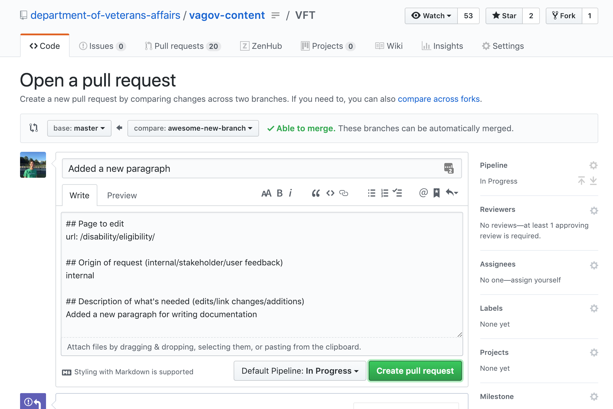
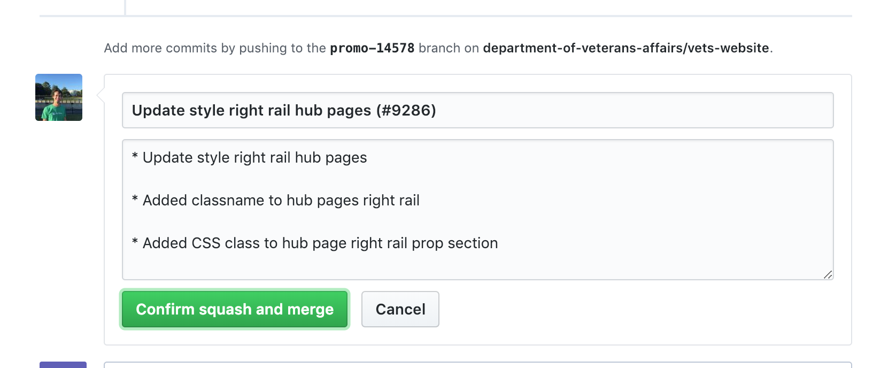
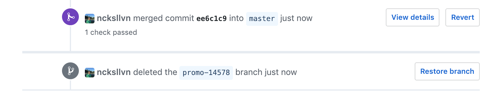

# How to edit content

## Where to find the correct page to edit
The [`pages`](https://github.com/department-of-veterans-affairs/vagov-content/tree/master/pages) directory of the Interim CMS reflects that of the published website - Each Markdown file (files with the `.md` file extension) is compiled into an HTML page of the corresponding location on the website. [Learn how to write content with Markdown](https://www.markdownguide.org).

For example, `pages/health-care/after-you-apply.md` is compiled into HTMl and then published to `https://www.va.gov/health-care/after-you-apply/`. So, if you need to edit that page, `pages/health-care/after-you-apply.md` is the markdown file you'll need to edit.

## How to edit content
The general steps to edit a page (or multiple pages) are as follows:

1. [Create a "branch" to group your changes](#create-a-branch-to-group-your-changes)
2. [Perform your page edits](#perform-your-page-edits)
2. [Open a "pull request" to propose the change](#open-a-pull-request)
3. [Assign a reviewer to approve your changes](#assign-a-reviewer)
4. ["Merge" your changes to publish them to the website](#merge-your-changes)

This can all be done on the homepage of the Interim CMS at GitHub.

---

### Create a branch to group your changes
A [branch](https://help.github.com/articles/about-branches/) is a term used to describe a collection of code. The default branch of GitHub projects is the "master" branch. This means that the code in the master branch is the code that is ultimately published to the live website. If you need to edit a page, you create your own branch to collect all of your changes. Later, you'll propose that the changes in your branch become part of the master branch.

#### 1. Start on the master branch
Near the top-left corner of the Interim CMS and just above the directories, you should notice a dropdown containing the words "Branch: master". This indicates that you're currently on the master branch.

If you don't see "master" in that dropdown, you may be exporing a different branch. To go to the master branch, you can click the dropdown, type "master", and then click the result that says "master" as shown below.

#### 2. Create your branch
Next, you'll create your own branch where you'll make your changes. To create the branch, click the dropdown in the top-left corner of the Interim CMS that should currently say "Branch: master". Then, type a name for you branch. This name is up to you, but in general it should describe the work you'll be doing in some way. Once you've typed your branch name, click the link to create the branch as shown below.

Once created, you'll automatically be switched from the master branch to your new branch. Because you created your branch while being on the master branch prior, the code in your new branch should be identical to those in the master branch.

---

### Perform your page edits
Now that you've created your own branch, you can make all of your edits.

#### 1. First, locate the page to be edited.

For example, to edit `www.va.gov/disability/eligibility/`, we would navigate to [`/pages/disability/eligibility.md`](https://github.com/department-of-veterans-affairs/vagov-content/blob/awesome-new-branch/pages/disability/eligibility.md).

#### 2. Click the pencil icon in the top-right corner of the panel containing the page contents to open an editor.

An editor like the one below should open -

__Pages are written using Markdown, whi

#### 3. Finally, save your changes.
Once you've made your changes, scroll to the bottom of the page. Once there, you should see a a box titled "Commit changes". On GitHub, this means to save your changes to your branch. To do so, just type a title along with an optional description, then press the green "Commit changes" button.

#### 4. Repeat for any additional edits
If there are any related edits that need to be made along with this, you can make those changes on the same branch. To do so, just confirm that the Branch dropdown in the top-corner reflects the name of your branch, and repeat the steps above.

---

### Open a pull request
A [pull request](https://help.github.com/articles/about-pull-requests/) is the term used to describe proposing the changes of your branch to become part of the master branch. You can think of the changes in your branch as drafts, and once moved into master via a pull request, those changes are published. To open a pull request, following these steps.

#### 1. Click the "Pull requests" tab along the top of the page

#### 2. Click the "New pull request" button in the top-right corner

#### 3. Select your branch for comparison with the master branch

#### 4. Click the "Create pull request" button

#### 5. Optionally, edit the title/description of your pull request and click "Create pull request"

Your pull request is created!

---

### Assign a reviewer
For a branch to be moved into master, your changes must be reviewed and approved by another member of the Interim CMS with edit access. Some members may be notified automatically, but in the event you would like to manually request a review, you can do so by following these steps.

#### 1. Along the right side of the page, click "Reviewers" to reveal a dropdown

#### 2. Select the member(s) to review your changes
You can request reviews from multiple users, although only 1 needs to approve your changes for your work to be able to be published.

#### 3. Await feedback from the reviewer
The member has been notified that you've requested their review. As part of the review process, the member may comment on your pull request with some questions or changes they'd like to see. However, once they're satisfied with the changes, they'll approve your pull request. As they respond, you'll receive notifications via email or on GitHub.

---

### Merge your changes
To see the changes on your branch become published to the live website, the changes need to become part of the master branch. The process of taking changes from one branch and integrating them into another branch is referred to as "merging." In this case, you would say you are "merging to master."

#### 1. Click the merge button
Once the pull request is approved, there will be a panel along the bottom of the page that contains a button with "Squash and merge" on it. First click that button to reveal a final form. Submit this form by clicking "Confirm squash and merge" as shown below:

#### 2. Done!
Once you've merged your branch, you should see a message similar to the one below. Optionally, you can also click the "Delete branch" button. Now that your branch has been integrated into the master branch, you don't need it anymore.

---

#### Done!
Congrats, your working has been merged! Your changes will become visible on our [Staging environment](https://staging.va.gov/) within 20 minutes.
