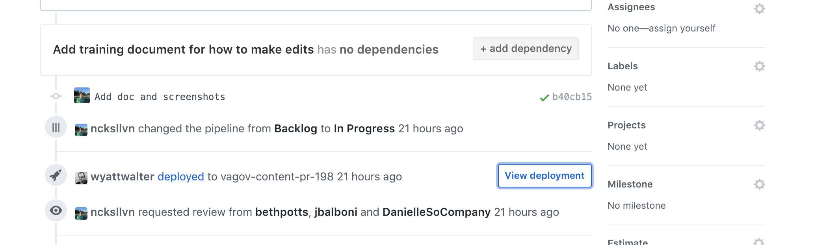

# How to edit content

## Where to find the correct page to edit
The [`pages`](https://github.com/department-of-veterans-affairs/vagov-content/tree/main/pages) directory of the Interim CMS reflects the structure (information architecture) of the published website. 

Each markdown file (files with the `.md` file extension) is compiled into an HTML page with a corresponding (matching) location on the website. In other words, the url for a webpage shows you the location of that page's file in github.  
[Learn how to write content with markdown](https://www.markdownguide.org).

For example, `pages/health-care/after-you-apply.md` is compiled into HTML and then published to `https://www.va.gov/health-care/after-you-apply/`. So, if you need to edit that page, `pages/health-care/after-you-apply.md` is the markdown file you'll need to edit.

## How to edit content
Follow these steps to edit a page (or multiple pages):

1. [Create a branch to collect your edits](#create-a-branch-to-collect-your-edits)
2. [Enter your edits](#enter-your-edits)
3. [Open a pull request to propose the edits](#open-a-pull-request-to-propose-the-edits)
4. [Assign a reviewer to approve your changes](#assign-a-reviewer-to-approve-your-changes)
5. [Request a merge to master to publish your changes to the website](#request-a-merge-to-master-to-publish-your-changes-to-the-website)

This can all be done on the homepage of the Interim CMS at GitHub.

---

### Create a branch to collect your edits
A [branch](https://help.github.com/articles/about-branches/) is a term used to describe a collection of code. The default branch of GitHub projects is the "master" branch. This means that the code in the master branch is the code that's ultimately published to the live website. If you need to edit a page, you create your own branch to collect all of your changes. Later, you'll propose that the changes in your branch become part of the master branch.

#### 1. Start from the master branch
Near the top-left corner of the Interim CMS, just above the directories, you should notice a dropdown containing the words "Branch: master." This indicates that you're currently on the master branch.

If you don't see "master" in that dropdown, you may be exporing a different branch. To go to the master branch, you can click the dropdown, type "master," and then click the result that says, "master." See below.

#### 2. Create your branch
Next, you'll create your own branch where you'll enter your edits. To create the branch, click the dropdown in the top-left corner of the Interim CMS that should currently say, "Branch: master." Then, type a name for your branch. This name is up to you, but in general it should describe the work you'll be doing in some way. Once you've typed your branch name, click the blue box that says, "Create branch," and includes the name you just typed. See below.

Once you've clicked that blue box, you've successfully created and can start editing in your branch. You're not in master anymore--github automatically locates you in your new branch. Because you created your branch from the master branch, the code in your new branch is identical to what's in the master branch.

---

### Enter your edits
Now that you've created your own branch, you can enter your edits.

#### 1. First, locate the page to be edited.

For example, to edit `www.va.gov/disability/eligibility/`, you'd navigate to [`/pages/disability/eligibility.md`](https://github.com/department-of-veterans-affairs/vagov-content/blob/awesome-new-branch/pages/disability/eligibility.md).

#### 2. Click the pencil icon (right next to the garbage can icon) in the top right corner of the panel containing the page contents.

 

An editor like the one below should open:

#### 3. Save your edits.
Once you've made your changes, scroll to the bottom of the page. You should see a box called "Commit changes." On GitHub, this means you'll be saving your changes to your branch. Just type a title along with an optional description, then press the green "Commit changes" button.

#### 4. Repeat the above 3 steps for any additional edits
If there are any related edits that need to be made on other pages, you can make those changes on the same branch. Before you open another file to edit, confirm that the Branch dropdown in the top left corner reflects the name of your branch, and repeat the steps above.

---

### Open a pull request to propose the edits
A [pull request](https://help.github.com/articles/about-pull-requests/) is the term for when you propose that the edits from your branch become part of the master branch. You can think of the edits in your branch as a draft, and once they're moved into master via a pull request, those edits get published. To open a pull request, follow these steps:

#### 1. Click the "Pull requests" tab toward the top of the page (the tab, not the link in the black stripe)

#### 2. Click the green "New pull request" button in the top-right corner

#### 3. Select your branch for comparison with the master branch

#### 4. Click the "Create pull request" button

Your pull request is created!

#### 6. Preview your changes
To confirm that your edits look the way you expect them to on the web page, you can use a Heroku review instance (a way to preview the page or pages you've edited). After you open a pull request in the Interim CMS, along the bottom right side of the page a "View deployment" button will become visible. (Sometimes, it takes about 2 minutes for this button to appear after you open the pull request.)

This button takes you to a version of the website generated from the code in your branch. You can preview any edits you make by clicking that link and navigating to the page where you made edits.

---

### Assign a reviewer to approve your changes
For a branch to be moved into master, your changes must be reviewed and approved by a member of the team with edit access. Content team members will be notified automatically, but if you would like to manually request a review by someone in addition to a content team member, just follow these steps.

#### 1. Along the right side of the page, click the gear icon next to "Reviewers" to see the dropdown with names

#### 2. Select the names of team members you'd like to review your changes
When you select a name, that team member will be notified that you've requested their review. You can request reviews from multiple people.

#### 3. Await feedback from the reviewer
The reviewer may comment on your pull request with some questions or changes they'd like to suggest--or they can make additional edits to supplement yours. When they comment or make additional edits, you'll receive a notification via email or on GitHub with the details. A content team member and anyone else you've chosen as a reviewer may provide feedback to you in this way.

---

### Request a merge to master to publish your changes to the website
Once you and the content team reviewer agree on all the edits, scroll to the bottom of the page where the "Leave a comment" box is. Put a note there requesting that they merge your edits into master. Your edits will become visible on our [Staging environment](https://staging.va.gov/) within 20 minutes.

---

### You're done! 
Congrats, your edits have been merged and will appear on the live site within 24 hours.
